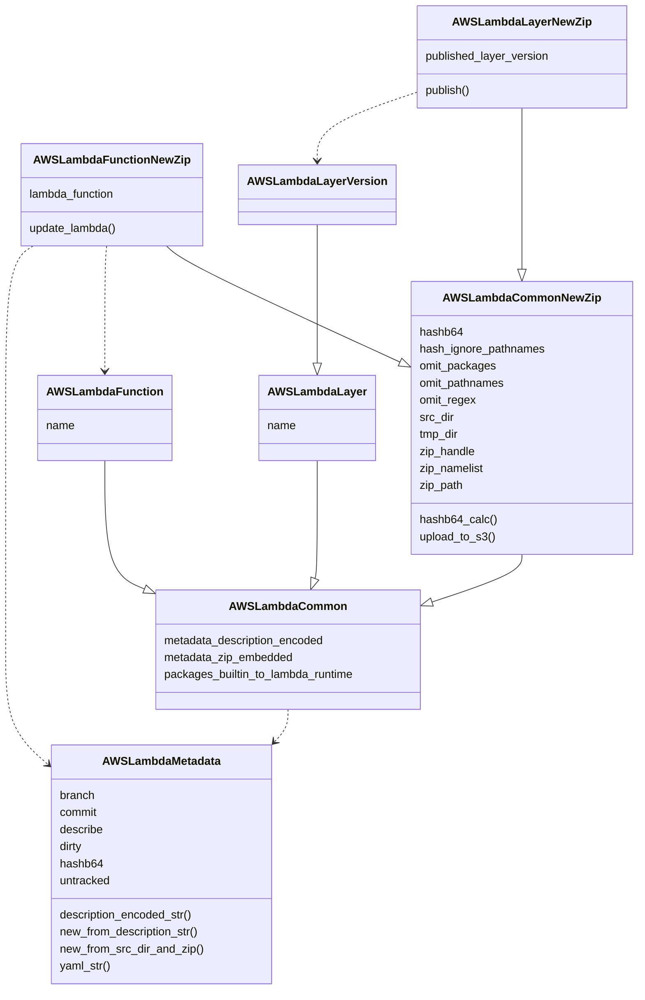

# Maintainability refactor plan

Pre-refactor classes:

* NewAwsLambdaLayerZip
* NewAwsLambdaZip
* AwsLambdaFunction
* AwsLambdaLayer
* AwsLambdaLayerVersion

Pre-refactor, these steps are performed with the following classes and high-level functions:

* metadata = git_get_metadata() + get_builder_metadata()
* check `pip` for `version >= 22.2`
* create tmp_dir
* create tmp_dir/lambda
* NewAwsLambdaZip()
* if layer_name in args:
  * NewAwsLambdaLayerZip(omit_pathnames = lambda_zip.zip_namelist, ...)
  * deduplicate layer
  * layer_zip.upload_to_s3()
  * set use_layer_version for later
* if upload_s3_url in args:
  * s3_upload
* if aws_lambda_update in args:
  * if layer_name in args: aws_lambda_update(layer_arn=...)
  * else: aws_lambda_update()
* done

None of the above is unreasonable.  A lot of what we need to do is just moving code into separate files
and utility functions into `lambda_zip_util.py`.

A few functions need to be made class methods.  Examples are upload_to_s3().

Metadata needs better organization.  We'll gather it all every time in one concise high-level function
or constructor, with helpers as needed for legibility.  We won't remove things from it, but we'll have
some method to fetch only what will fit into the description-encoded metadata, and another method to fetch
YAML for the ZIP file, and another for the S3 metadata JSON.  This should make it easier to understand
what goes where and how.

# Classes

## AWSLambdaFunction

## AWSLambdaFunctionNewZip

Instantiate this class to create a new `.zip` file without necessarily accessing AWS API or uploading
anything.  Pre-refactor this was called `NewAwsLambdaZip`

## AWSLambdaVersion

## AWSLambdaLayer

## AWSLambdaLayerNewZip

## AWSLambdaLayerVersion

# Utility Functions

Utility functions will go into separate `lambda_zip_util.py` importable by all.
